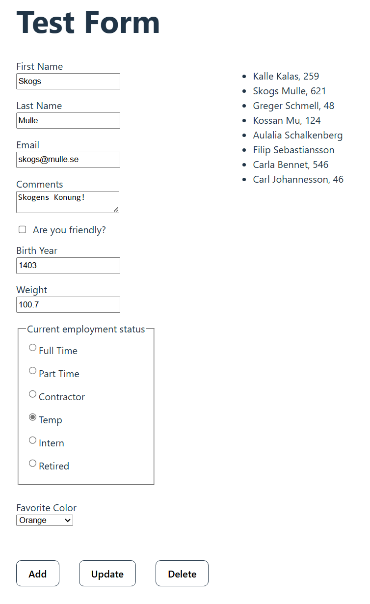
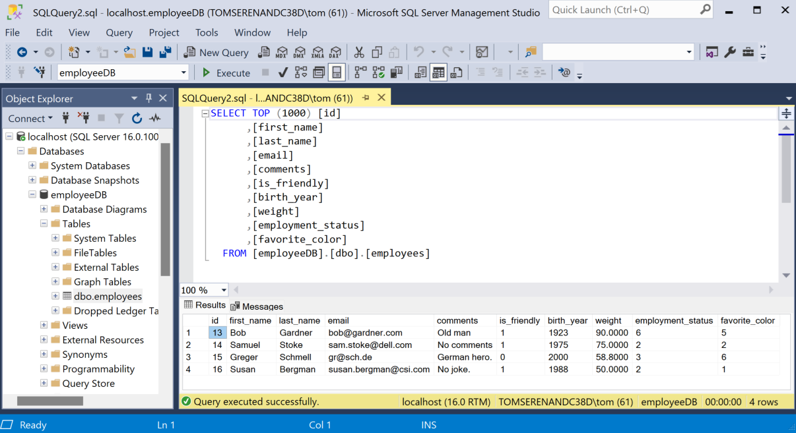

# React Client with ASP.NET Core Web API

 

## Description
This is a fullstack CRUD (Create, Read, Update, Delete) application with a React client, an ASP.NET Core Web API and a SQL Server database.

 

 

## Technologies
- HTML
- CSS
- JavaScript
- React
- ASP.NET Core Web API
- C#
- SQL Server

 

## User Interface / Client
<kbd></kbd>

The form shown above is used to execute the CRUD operations. I included quite a lot of input fields in order to handle many data types. 

The React app includes the following techniques:
- [Controlled inputs](https://react.dev/reference/react-dom/components/input#controlling-an-input-with-a-state-variable) for good practice on how to handle form data.
- [Axios package](https://axios-http.com/) to make http requests to the Web API.

When using "Update" and "Delete" you have to first select the item in the list at the right.

 

## Database

The Employee data is stored in a SQL Server database table (see above).

 

## Inspirations and Credits
- [Build app using React JS, .NET Core Web API and Microsoft SQL Server](https://www.youtube.com/watch?v=O5hKoBV3vaU)
- [Product Management Application using .NET Core 6 and React JS with CRUD Operations](https://medium.com/@jaydeepvpatil225/product-management-application-using-net-core-6-and-react-js-with-crud-operation-1f8bb9f709ba)
- [CRUD Operations Using ASP.NET Core Web API And ReactJS](https://www.c-sharpcorner.com/article/crud-operations-using-asp-net-core-web-api-and-reactjs/)
- [The Frontend Developer Career Path (Scrimba)](https://v2.scrimba.com/the-frontend-developer-career-path-c0j)
