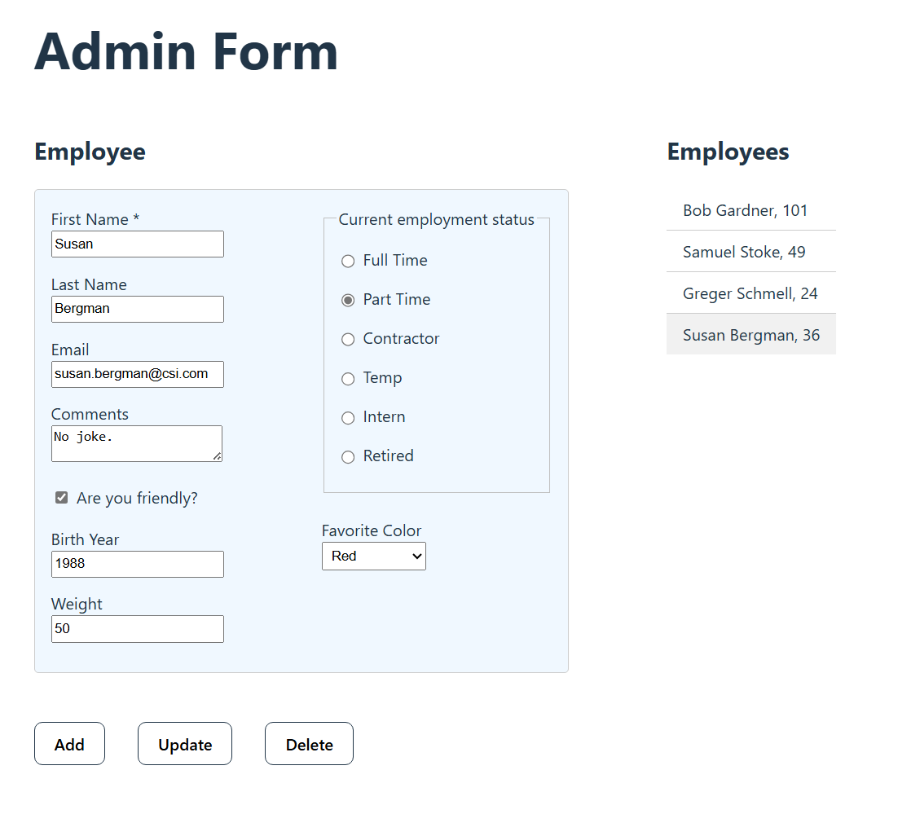

# React Client with ASP.NET Core Web Api

## Description
This is a fullstack CRUD (Create, Read, Update, Delete) application with a React client, an ASP.NET Core Web API and a SQL Server database.

 

## Technologies
- HTML
- CSS
- JavaScript
- React
- ASP.NET Core Web API
- C#
- SQL Server

## User Interface / Client
<kbd></kbd>

The form shown above is used to execute the CRUD operations. There are several input fields in order to include many data types. 

When using "Update" and "Delete" you have to first select the item in the list at the right.
## Demo
